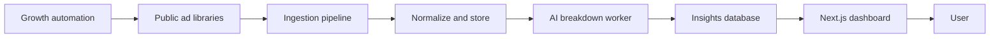

# Adoracle

> AI ad intelligence. See what is working in your market before you spend.

Adoracle pulls competitor ads from public ad libraries and breaks them down with AI: the hooks, the angles, and the structures that make them convert. It is built as a TypeScript monorepo with a Next.js web app and background worker services.

> This repository is an architecture overview. The production code and data are private.

## How it works

## Stack

**Web** &nbsp; Next.js, React, TypeScript
**Services** &nbsp; Node workers, REST API
**AI** &nbsp; LLMs
**Ingestion** &nbsp; Ad library scraping, Apify
**Billing** &nbsp; Gumroad

## Engineering highlights

- A monorepo split into independent web, API, and worker services that scale separately.
- An ad ingestion pipeline that normalizes creative across multiple sources into one schema.
- An AI breakdown engine that extracts hooks, angles, and offers from raw ad creative.
- A growth automation suite for content generation and scheduled distribution.
- Lifetime deal billing handled through Gumroad.

## Status

Built and in market.

---

Part of the work of [Denis Redzic](https://denis.denisai.online).
